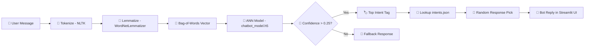

<div align="center">


<br/>

### An intelligent medical chatbot powered by NLP and a Deep Learning ANN — deployed as a real-time Streamlit web app.

<br/>

[](https://www.python.org/)
[](https://streamlit.io/)
[](https://www.tensorflow.org/)
[](https://keras.io/)
[](https://www.nltk.org/)
[](LICENSE)

<br/>

[🚀 Live Demo](#-live-demo) · [📖 Overview](#-overview) · [🧠 How It Works](#-how-it-works) · [🏗️ Architecture](#️-model-architecture) · [⚙️ Installation](#️-installation--setup) · [📁 Project Structure](#-project-structure)

<br/>

> ⚠️ **Disclaimer:** MedIntent-Bot is for **informational purposes only**. It is not a substitute for professional medical advice, diagnosis, or treatment.

---

</div>

## 📖 Overview

**MedIntent-Bot** is an end-to-end deep learning chatbot that understands medical queries and responds with relevant, intent-matched answers in real time. It uses a **Bag-of-Words + ANN** pipeline to classify user intent from text input, then retrieves a contextual response from a curated medical intents database.

This project demonstrates the **complete NLP + deep learning lifecycle**:

```
Raw Text → NLP Preprocessing → Bag-of-Words → ANN Intent Classifier → Response Retrieval → Streamlit UI
```

> 💡 Unlike rule-based chatbots, MedIntent-Bot uses a **trained neural network** to understand intent — making it robust to varied phrasing of the same medical question.

---

## ✨ Features

| Feature | Description |
|---|---|
| 🧠 **Deep Learning Intent Classification** | ANN trained on medical intents classifies user queries with confidence thresholds |
| 🧹 **NLP Preprocessing Pipeline** | Tokenization, lowercasing, and WordNet lemmatization for clean input |
| 📦 **Bag-of-Words Vectorization** | Converts cleaned text into a fixed-size binary feature vector matching the training vocabulary |
| 🎲 **Dynamic Response Selection** | Randomly picks from multiple valid responses per intent for natural conversation variety |
| 🛡️ **Confidence Threshold Filtering** | Only returns predictions above `ERROR_THRESHOLD = 0.25` — gracefully falls back for low-confidence inputs |
| 💬 **Persistent Chat History** | Full conversation history maintained across the session using `st.session_state` |
| 🔍 **Debug Mode** | Expandable debug panel shows raw intent predictions and confidence scores per message |
| ⚡ **Cached Model Loading** | Uses `@st.cache_resource` to load model and artifacts once — fast reloads with no repeated I/O |
| ☁️ **Cloud-deployable** | Ready for Streamlit Community Cloud, Render, or any Python host |

---

## 🧠 How It Works


### Step-by-step pipeline

1. **Tokenize** — split user input into individual words using `nltk.word_tokenize`
2. **Lemmatize** — reduce each word to its base form using `WordNetLemmatizer` (e.g. "medicines" → "medicine")
3. **Bag-of-Words** — encode the cleaned sentence as a binary vector against the trained vocabulary (`words.pkl`)
4. **ANN Prediction** — pass the vector through the trained `chatbot_model.h5` to get per-intent probabilities
5. **Threshold Filter** — keep only predictions above `ERROR_THRESHOLD = 0.25`; return fallback if none qualify
6. **Response Retrieval** — look up `intents.json` for the top intent tag and randomly pick one of its responses
7. **Display** — render reply in the Streamlit chat UI with optional debug info showing raw intent probabilities

---

## 🏗️ Model Architecture

The ANN is a feedforward neural network trained on bag-of-words feature vectors:

```
Input Layer  →  [ vocab_size features — one per known word ]
                          ↓
          ┌───────────────────────────────┐
          │   Dense (ReLU activation)     │  ← learns word-pattern combinations
          └───────────────────────────────┘
                          ↓
          ┌───────────────────────────────┐
          │   Dense (ReLU activation)     │  ← deeper intent representations
          └───────────────────────────────┘
                          ↓
          ┌───────────────────────────────┐
          │   Dense (Softmax activation)  │  ← probability per intent class
          └───────────────────────────────┘
                          ↓
Output  →  [ num_classes probabilities ]  →  Top intent tag
```

**Saved artifacts:**

| File | Description |
|---|---|
| `artifact/chatbot_model.h5` | Trained Keras ANN model |
| `artifact/words.pkl` | Vocabulary (lemmatized words from training data) |
| `artifact/classes.pkl` | Intent class labels |
| `data/intents.json` | Medical intents: tags, patterns, and responses |

---

## 🛠️ Tech Stack

| Category | Tools & Libraries |
|---|---|
| **Language** | Python 3.10+ |
| **Deep Learning** | TensorFlow / Keras (ANN — Dense layers, Softmax) |
| **NLP** | NLTK (tokenization, WordNet lemmatizer) |
| **Web App / UI** | Streamlit (chat UI, session state, caching) |
| **Model Serialization** | Pickle (words, classes), Keras HDF5 (model) |
| **Data** | JSON (intents database) |
| **Deployment** | Streamlit Community Cloud / Render |
| **Version Control** | Git & GitHub |

---

## 📁 Project Structure

```
MedIntent-Bot/
│
├── app.py                      # Streamlit app — UI, inference, chat logic
│
├── artifact/
│   ├── chatbot_model.h5        # Trained ANN model (Keras HDF5)
│   ├── words.pkl               # Vocabulary from training
│   └── classes.pkl             # Intent class labels
│
├── data/
│   └── intents.json            # Medical intents: tags, patterns, responses
│
├── notebooks/
│   └── ChatBot.ipynb          # Full training notebook (EDA → model → save)
│
├── requirements.txt            # Python dependencies
├── .gitignore                  # Git ignored files (venv, __pycache__, etc.)
├── LICENSE                     # MIT License
└── README.md                   # Project documentation
```

---

## ⚙️ Installation & Setup

### 1. Clone the repository
```bash
git clone https://github.com/Rohitranelab/ChatBot.git
cd ChatBotMedIntent-Bot
```

### 2. Create and activate a virtual environment
```bash
python -m venv venv

# Windows
venv\Scripts\activate

# macOS/Linux
source venv/bin/activate
```

### 3. Install dependencies
```bash
pip install -r requirements.txt
```

### 4. Download required NLTK data
```python
import nltk
nltk.download('punkt')
nltk.download('punkt_tab')
nltk.download('wordnet')
```

### 5. Run the app
```bash
streamlit run app.py
```

The app will open automatically at **`http://localhost:8501`** 🎉

---

## 🚀 Live Demo

> 🔗 **[Click here to try the live app](https://your-app-name.streamlit.app)**

_Type any medical question and get an instant, intent-matched response from the bot._

---

## 🔍 Example Conversations

| You say... | MedIntent-Bot replies... |
|---|---|
| `"What are the symptoms of diabetes?"` | Explains common diabetes symptoms |
| `"How can I lower my blood pressure?"` | Suggests lifestyle and medical options |
| `"I have a headache, what should I do?"` | Provides guidance and when to seek help |
| `"Tell me about COVID-19"` | Returns relevant COVID information |
| `"xyzabc 123"` | *"I'm not sure I understand. Could you rephrase that?"* (fallback) |

---

## 🌱 Future Improvements

- [ ] Expand `intents.json` with more medical topics and multi-turn dialogue support
- [ ] Add LSTM / Bidirectional LSTM for better sequential understanding
- [ ] Fine-tune a pre-trained BERT model for higher accuracy
- [ ] Add confidence score display in the chat UI
- [ ] Support voice input (speech-to-text integration)
- [ ] Add MLflow experiment tracking for training runs
- [ ] Dockerize the app for consistent cross-platform deployment
- [ ] Add CI/CD pipeline with GitHub Actions
- [ ] Multi-language support for regional medical queries

---

## 📜 License

This project is licensed under the **MIT License** — see the [LICENSE](LICENSE) file for details.

---

## 👨‍💻 Author

### Rohit Rane

Aspiring Machine Learning Engineer | MLOps Enthusiast

- Machine Learning
- MLOps
- FastAPI
- MongoDB
- Python

[](https://github.com/Rohitranelab)

_Building end-to-end AI systems — from model training to production deployment._

---

⭐ **Found this useful? Give it a star — it helps others discover the project!** ⭐

</div>