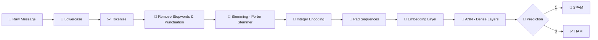

<div align="center">


<br/>

### Detect spam messages instantly using NLP + ANN — deployed as an interactive Streamlit web app.

<br/>

[](https://www.python.org/)
[](https://streamlit.io/)
[](https://keras.io/)
[](https://www.tensorflow.org/)
[](https://www.nltk.org/)
[](LICENSE)

<br/>

[🚀 Live Demo](#-live-demo) · [📖 Overview](#-overview) · [🧠 How It Works](#-how-it-works) · [⚙️ Installation](#️-installation--setup) · [📊 Model Performance](#-model-performance) · [📁 Project Structure](#-project-structure)

<br/>

---

</div>

## 📖 Overview

**SMS / Email Spam Classifier** is a supervised deep learning project that classifies messages as **Spam 🚫** or **Not Spam ✅ (Ham)** in real time. It combines a robust **NLP preprocessing pipeline** with an **Artificial Neural Network (ANN)** built on top of word **Embeddings**, wrapped in a clean and interactive **Streamlit** web interface.

This project demonstrates the **complete ML lifecycle** — from raw text all the way to a live, production-ready app:

```
Raw Text → Preprocessing → Tokenization → Embedding → ANN → Prediction → Streamlit UI
```

> 💡 Unlike traditional bag-of-words approaches, this project uses a **learned Embedding layer** that captures semantic meaning of words, giving the ANN richer features to learn from.

---

## ✨ Features

| Feature | Description |
|---|---|
| ⚡ **Real-time detection** | Paste any SMS or email text and get an instant Spam/Ham prediction |
| 🧹 **NLP pipeline** | Lowercasing, tokenization, stopword removal, punctuation filtering, stemming |
| 🔢 **Word Embedding** | Keras `Embedding` layer learns dense word representations during training |
| 🧠 **ANN Classifier** | Feedforward neural network trained end-to-end on embedded text features |
| 💾 **Model persistence** | Trained model and tokenizer saved with `pickle` for instant inference |
| 🎨 **Clean Streamlit UI** | Responsive, minimal web interface — no frontend framework needed |
| ☁️ **Cloud-ready** | Deployable on Streamlit Community Cloud, Render, or any Python host |

---

## 🧠 How It Works



### Step-by-step pipeline

1. **Lowercase** — normalize all text to avoid case-sensitive mismatches
2. **Tokenize** — split into individual words using `nltk.word_tokenize`
3. **Clean** — remove non-alphanumeric tokens, stopwords, and punctuation
4. **Stem** — reduce words to root form using `PorterStemmer` (e.g., "running" → "run")
5. **Integer encode** — map each word to a unique integer using `Tokenizer`
6. **Pad sequences** — ensure uniform input length via `pad_sequences`
7. **Embed** — convert integers to dense word vectors via a learned `Embedding` layer
8. **ANN forward pass** — Dense hidden layers learn to separate spam patterns from ham
9. **Predict** — sigmoid output gives a probability; threshold at 0.5 → final label

---

## 🏗️ Model Architecture

```
Input (padded sequence of integers)
        ↓
┌─────────────────────────────────┐
│   Embedding Layer               │  vocab_size × embedding_dim
│   (learns word representations) │
└─────────────────────────────────┘
        ↓  Flatten
┌─────────────────────────────────┐
│   Dense (128 units, ReLU)       │
└─────────────────────────────────┘
        ↓
┌─────────────────────────────────┐
│   Dense (64 units, ReLU)        │
└─────────────────────────────────┘
        ↓
┌─────────────────────────────────┐
│   Dense (1 unit, Sigmoid)       │  → Spam probability
└─────────────────────────────────┘
```

---

## 🛠️ Tech Stack

| Category | Tools & Libraries |
|---|---|
| **Language** | Python 3.10+ |
| **Deep Learning** | TensorFlow / Keras (ANN, Embedding, Dense layers) |
| **NLP** | NLTK (tokenization, stopwords, Porter Stemmer) |
| **Web App / UI** | Streamlit |
| **Model Serialization** | Pickle |
| **Data Handling** | NumPy, Pandas |
| **Visualization (EDA)** | Matplotlib, Seaborn |
| **Deployment** | Streamlit Community Cloud / Render |
| **Version Control** | Git & GitHub |

---

## 📁 Project Structure

```
Spam-Classifier/
│
├── app.py                  # Streamlit app — UI + inference logic
├── spam_classifier.ipynb   # Full training notebook (EDA → model → save)
├── model.pkl               # Trained ANN model (Keras)
├── tokenizer.pkl           # Fitted Keras Tokenizer
├── requirements.txt        # Python dependencies
├── LICENSE                 # MIT License
└── README.md               # Project documentation
```

---

## ⚙️ Installation & Setup

### 1. Clone the repository
```bash
git clone https://github.com/Rohitranelab/Spam-Classifier.git
cd Spam-Classifier
```

### 2. Create and activate a virtual environment
```bash
python -m venv venv

# Windows
venv\Scripts\activate

# macOS/Linux
source venv/bin/activate
```

### 3. Install dependencies
```bash
pip install -r requirements.txt
```

### 4. Download required NLTK data
```python
import nltk
nltk.download('punkt')
nltk.download('punkt_tab')
nltk.download('stopwords')
```

### 5. Run the app
```bash
streamlit run app.py
```

The app will open automatically at **`http://localhost:8501`** 🎉

---

## 🚀 Live Demo

> 🔗 **[Click here to try the live app](https://your-app-name.streamlit.app)**

_Type or paste any SMS or email message and get a real-time Spam / Ham prediction instantly._

---

## 📊 Model Performance

| Metric | Score |
|---|---|
| ✅ Accuracy | **0.96** |
| 🎯 Precision | **1.00** |

> **Why precision matters here:** A false positive (marking a genuine message as spam) is far more disruptive than a false negative. The model is tuned to achieve **perfect precision (1.0)** — meaning every message it flags as spam truly is spam.

---

## 🔍 Example Predictions

| Message | Prediction |
|---|---|
| `"Congratulations! You've won a FREE iPhone. Click now!"` | 🚫 **SPAM** |
| `"Hey, are we still meeting at 5pm today?"` | ✅ **HAM** |
| `"URGENT: Your account has been compromised. Verify now!"` | 🚫 **SPAM** |
| `"Please find the attached report for Q3 review."` | ✅ **HAM** |

---

## 🌱 Future Improvements

- [ ] Display prediction confidence score / probability
- [ ] Support batch prediction via CSV file upload
- [ ] Experiment with LSTM / Bidirectional LSTM for sequential patterns
- [ ] Fine-tune a BERT model for comparison
- [ ] Add MLflow experiment tracking
- [ ] Dockerize the app for consistent cross-platform deployment
- [ ] Add CI/CD pipeline with GitHub Actions
- [ ] Write unit tests for preprocessing and inference pipeline

---

## 📜 License

This project is licensed under the **MIT License** — see the [LICENSE](LICENSE) file for details.

---

## 👨‍💻 Author

<div align="center">

### Rohit Rane
**Aspiring Machine Learning Engineer | Deep Learning | NLP | MLOps**

[](https://github.com/Rohitranelab)

_Passionate about building end-to-end ML systems — from model training to production deployment._

---

⭐ **Found this useful? Give it a star — it helps others discover the project!** ⭐

</div>